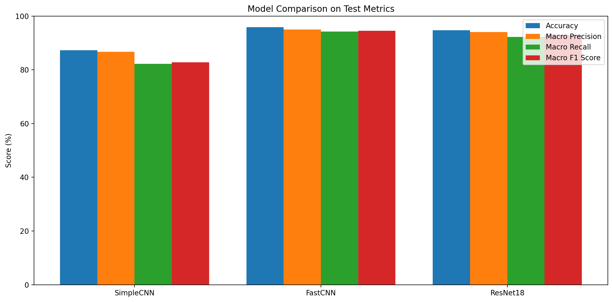
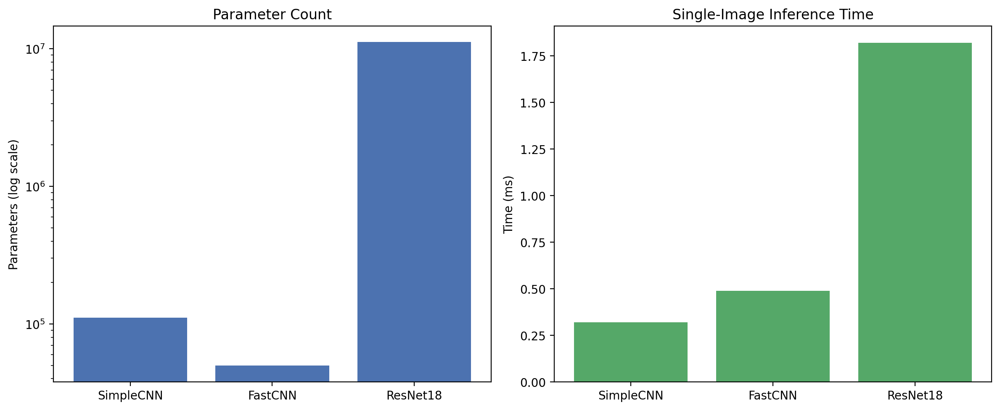
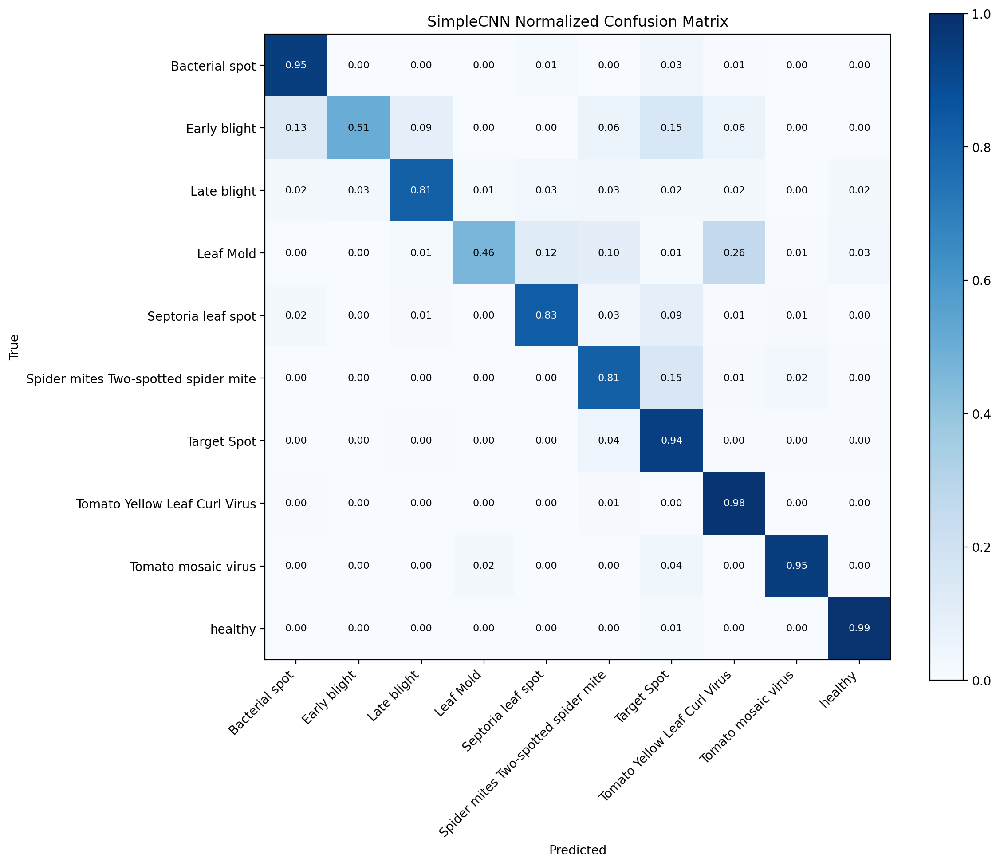
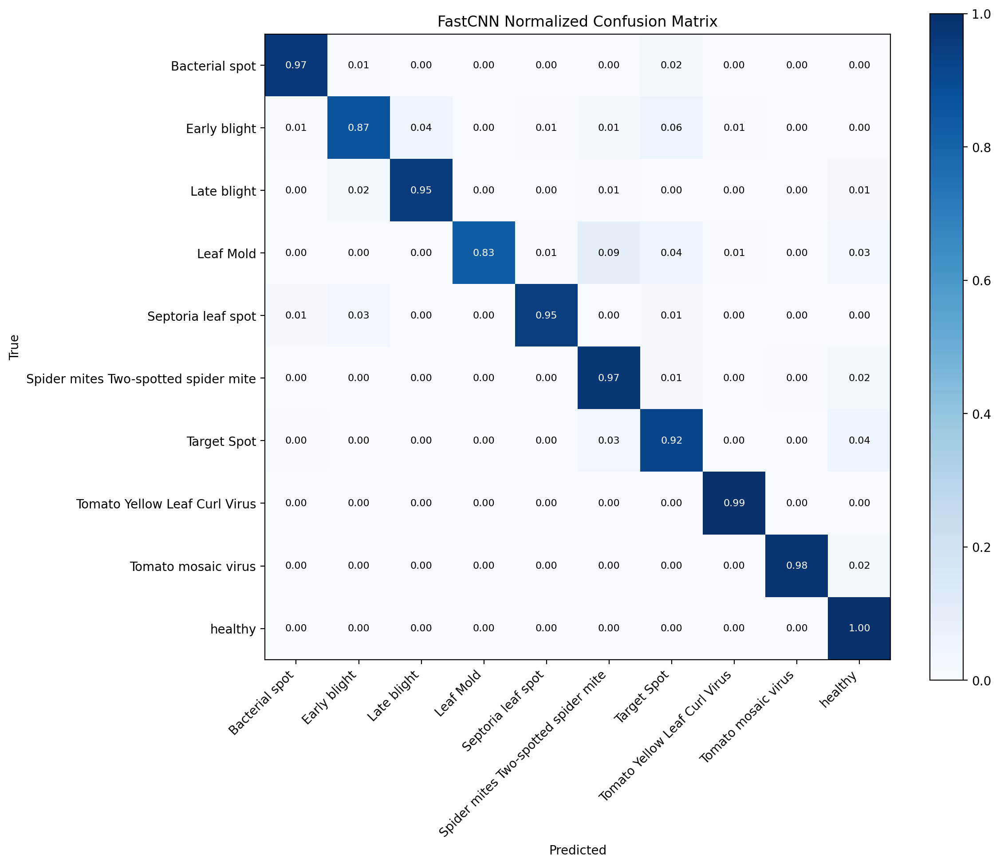
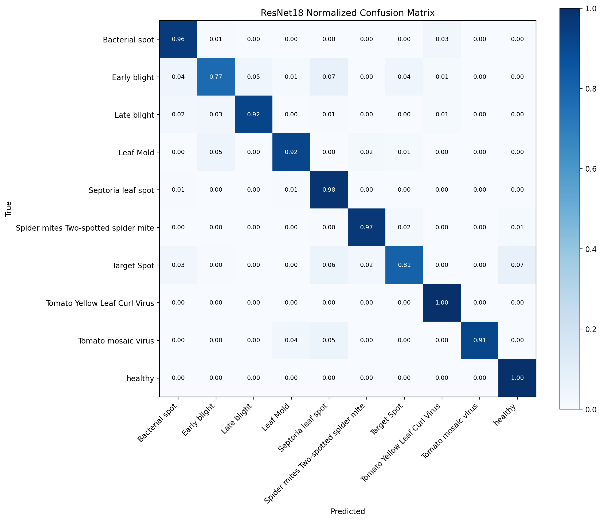
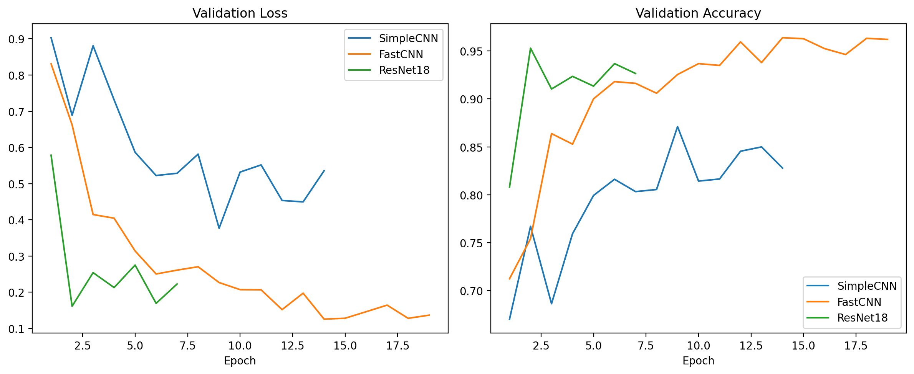

# 5. 实验与结果分析
## 5.1 实验环境
- 操作系统：Linux-6.6.87.2-microsoft-standard-WSL2-x86_64-with-glibc2.39
- Python：3.11.14；PyTorch：2.9.1+cu128
- 计算设备：NVIDIA GeForce RTX 4060 Laptop GPU
- 数据配置：`color`；输入尺寸：`224×224`
- 批大小：`32`；初始学习率：`0.001`；权重衰减：`0.0001`
- 优化器：`Adam`；损失函数：`CrossEntropyLoss`；学习率调度：`cosine`；早停耐心值：`5`

## 5.2 评价指标
- Accuracy 表示测试样本中被正确分类的比例，用于衡量模型整体分类正确率。
- Precision 表示被模型预测为某一类别的样本中，真正属于该类别的比例，用于衡量预测结果的可靠性。
- Recall 表示某一真实类别样本中被模型正确识别出来的比例，用于衡量漏检情况。
- F1 为 Precision 与 Recall 的调和平均值，兼顾准确性与召回能力；本文表格中的 Precision、Recall、F1 均采用宏平均形式统计。

## 5.3 对比实验结果
表 5-1 展示了三种模型在番茄叶片病害识别任务上的测试结果。

| 模型 | Accuracy | Precision | Recall | F1 | 参数量 | 单张推理时间(ms) | 最佳验证准确率 |
| --- | ---: | ---: | ---: | ---: | ---: | ---: | ---: |
| SimpleCNN | 0.8730 | 0.8667 | 0.8226 | 0.8275 | 111274 | 0.3188 | 0.8711 |
| FastCNN | 0.9585 | 0.9497 | 0.9429 | 0.9451 | 49866 | 0.4874 | 0.9640 |
| ResNet18 | 0.9471 | 0.9405 | 0.9226 | 0.9303 | 11181642 | 1.8200 | 0.9530 |

从总体指标看，FastCNN在测试集上取得最高准确率 0.9585，宏平均 F1 达到 0.9451。
推理效率方面，SimpleCNN 的单张图像平均推理时间最短，为 0.3188 ms；模型规模最小的是 FastCNN。
FastCNN 的参数量为 49866，低于 SimpleCNN 的 111274，仅约为 ResNet18 的 0.4460%。
综合准确率、参数量与推理时间三项指标，FastCNN 在本任务上呈现出更均衡的性能—效率折中。

## 5.4 混淆矩阵分析
归一化混淆矩阵用于观察各类别之间的误判分布，不同模型的主要误差模式如下。

### SimpleCNN

- `SimpleCNN` 主要误分类集中在 `Spider mites Two-spotted spider mite → Target Spot`，出现 38 次，占该真实类别样本的 15.08%。
- `SimpleCNN` 主要误分类集中在 `Leaf Mold → Tomato Yellow Leaf Curl Virus`，出现 37 次，占该真实类别样本的 25.87%。
- `SimpleCNN` 主要误分类集中在 `Septoria leaf spot → Target Spot`，出现 24 次，占该真实类别样本的 9.06%。

### FastCNN

- `FastCNN` 主要误分类集中在 `Leaf Mold → Spider mites Two-spotted spider mite`，出现 13 次，占该真实类别样本的 9.09%。
- `FastCNN` 主要误分类集中在 `Early blight → Target Spot`，出现 9 次，占该真实类别样本的 6.00%。
- `FastCNN` 主要误分类集中在 `Target Spot → healthy`，出现 9 次，占该真实类别样本的 4.27%。

### ResNet18

- `ResNet18` 主要误分类集中在 `Target Spot → healthy`，出现 15 次，占该真实类别样本的 7.11%。
- `ResNet18` 主要误分类集中在 `Target Spot → Septoria leaf spot`，出现 13 次，占该真实类别样本的 6.16%。
- `ResNet18` 主要误分类集中在 `Bacterial spot → Tomato Yellow Leaf Curl Virus`，出现 11 次，占该真实类别样本的 3.45%。

## 5.5 Loss/Accuracy 曲线分析
下图给出了三种模型在验证集上的 loss 和 accuracy 曲线。

- `SimpleCNN` 共完成 14 个 epoch，最佳验证准确率出现在第 9 轮，为 0.8711，最小验证损失为 0.3766。
- `FastCNN` 共完成 19 个 epoch，最佳验证准确率出现在第 14 轮，为 0.9640，最小验证损失为 0.1254。
- `ResNet18` 共完成 7 个 epoch，最佳验证准确率出现在第 2 轮，为 0.9530，最小验证损失为 0.1610。
- ResNet18 在较少 epoch 内即达到较高验证精度，体现出迁移学习的快速收敛特性。
- FastCNN 的验证曲线整体更平稳，在后期仍能保持较高精度，说明轻量化结构没有明显牺牲泛化能力。
- SimpleCNN 的验证精度提升较早进入平台区，后期继续训练的收益有限，早停策略有效避免了无效迭代。

## 5.6 本章小结
- 在当前 10 类番茄叶片病害识别任务中，FastCNN 取得了代表性最强的综合结果，测试准确率为 0.9585，宏平均 F1 为 0.9451。
- 轻量化网络在本任务中展现出较好的性能—复杂度平衡，说明针对植物病害图像分类设计紧凑卷积结构是可行的。
- 迁移学习模型具备更快的前期收敛速度，但在模型规模与部署成本方面明显高于轻量模型。
- 综合实验结果，轻量 FastCNN 更适合作为本课题的主模型方案。